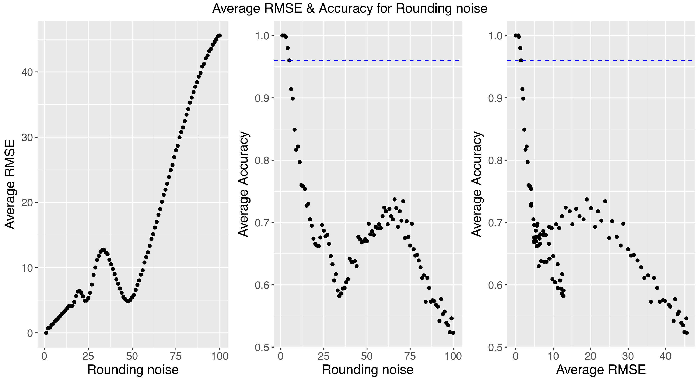
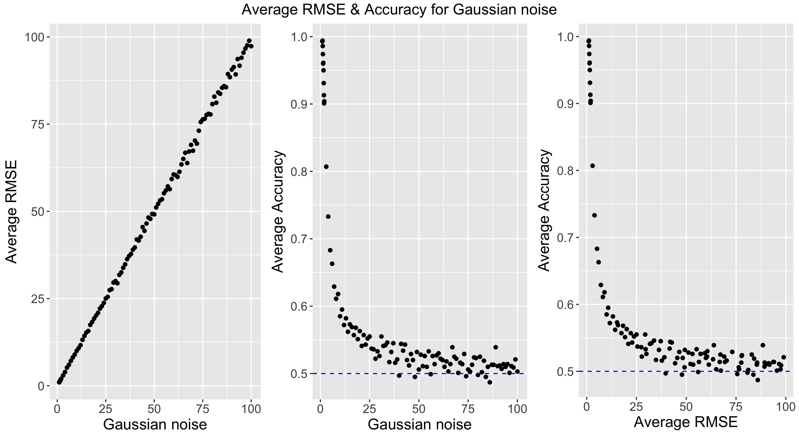
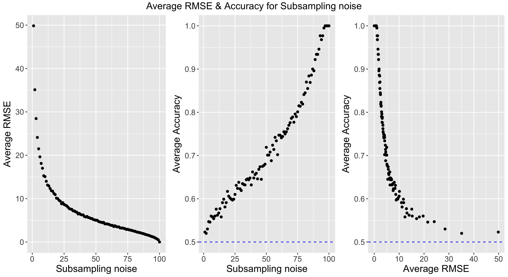
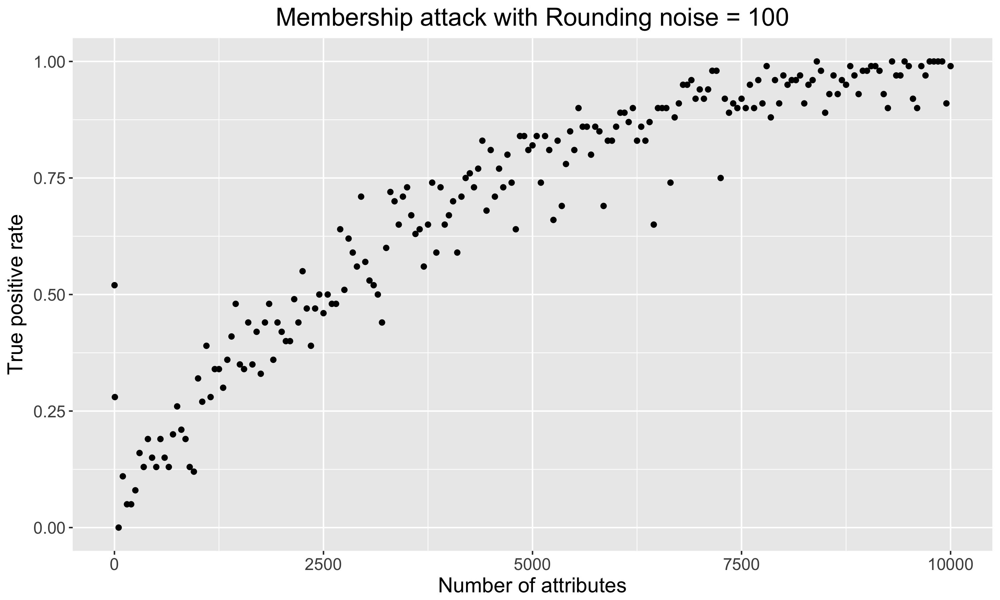
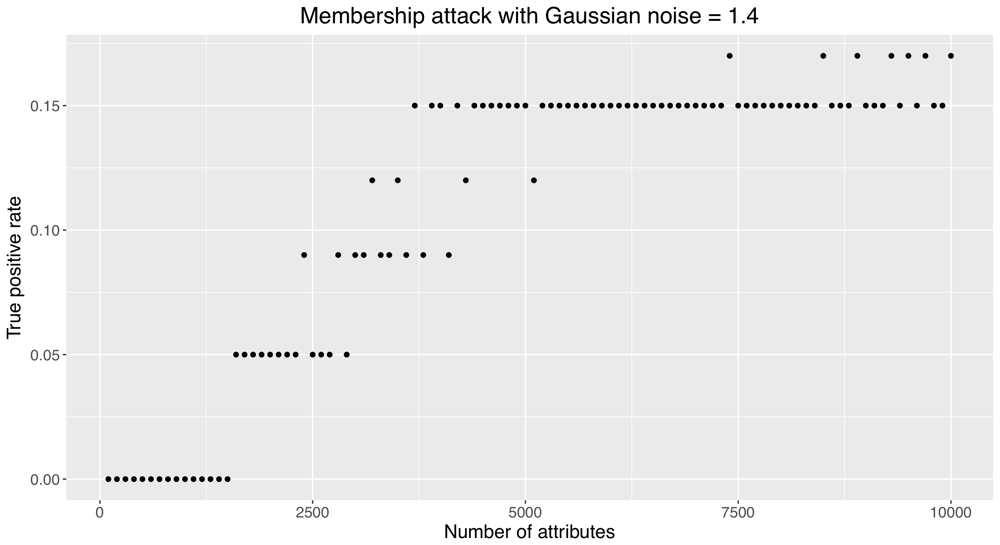
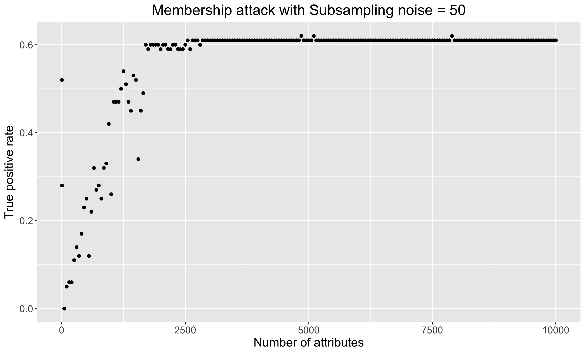

I collaborated Anthony Rentsch and Lipika Ramaswamy on this homework.
```{r setup, include=FALSE}
knitr::opts_chunk$set(echo = TRUE)
```

## 1. Reidentification Attack
To perform a reidentification attack on this PUMS dataset from the 2000 Census, I could obtain the Georgia voter registration file, which contains an individual's residential address, year of birth, gender, and race ([Georgia's voter registration list](http://sos.ga.gov/index.php/elections/order_voter_registration_lists_and_files)). The individual's residential address could be used to identify which PUMA code he or she belongs to. A voter's "year of birth" would be used to calculate his/her age, while race would be used to match against the "latino", "black", and "asian" features we have in the PUMA dataset. Lastly, a voter's gender would be used to match against the "sex" feature in the PUMA dataset.<br>
Assuming the individuals from the voter registration file are also in the 5% PUMA sample, I was able to uniquely identify 598 individuals in the PUMA dataset based on the available features from the voter registration file. This translate to reidentifying 2.3% of the individuals in the dataset.<br>
Below is my code for performing the reidentification attack. It can also be accessed on [Github](https://github.com/bhavenp/cs208/blob/master/homework/HW1/HW1_1.R).
```{}
library(plyr);
library(dplyr);

#read in the PUMS
data <- read.csv("../../data/FultonPUMS5full.csv");

#groupby PUMA region, age, sex, and race in data
data_gb <- data %>% group_by(puma, sex, age, latino, black, asian) %>% summarise(n=n());
#get rows of groupby where we only have unique individuals
unique_indivs <- data_gb[data_gb$n == 1, ];
print(nrow(unique_indivs))
#calculate the percent of people that I could uniquely
perc_unq <- nrow(unique_indivs) / nrow(data);
print(perc_unq)
```


## 2. Reconstruction Attack
The code for my reconstruction attack can be accessed on [Github](https://github.com/bhavenp/cs208/blob/master/homework/HW1/HW1_2.R) and is displayed below.
```{}
rm(list=ls());
library(plyr); #import this library for doing rounding for noise
library(ggplot2); #import library for plotting
library(grid);

#### Parameters ####
prime <- 113; # prime number for hashing creating random vectors to pass to query
n <- 100;        # Dataset size
k.trials <- 2*n;  # Number of queries
num_exps <- 10; #number of experiments
noise_input <- "Rounding"; # What type of noise will be used as defense. Can be "Rounding", "Gaussian", or "Subsampling"

noise_vec <- c(1:100); #noise parameters for Rounding and Subsampling
# noise_vec <- c(seq(1, 1.9, 0.1), 2:100); #noise parameters for Gaussian


#### Import Data ####
pums_100 <- read.csv(file="../../data/FultonPUMS5sample100.csv"); #read in data from data folder
#trim dataset to only the PUB categories plus "uscitizen"
pums_100_trimmed <- pums_100[, c("sex", "age", "educ","income", "latino", "black", "asian",  "married", "divorced", "children", "employed", "militaryservice", "disability", "englishability", "uscitizen")];

#### Query function ####
query <- function(random_vec, data, prime, noise_type, noise_param){
  data_mat <- data.matrix(data[, 1:14]); # convert all rows and PUB categories into matrix
  #multiply matrix by random vector and 
  person_in_sum <- (data_mat %*% random_vec) %% prime %% 2; 
  us_citz_sum <- sum(person_in_sum * data[, 15]);
  
  if(noise_type == "Rounding"){
    noisy_sum <- round_any(us_citz_sum, noise_param); #this function will round the sum according to a multiple of noise_param 
  }
  else if(noise_type == "Gaussian"){
    noisy_sum <- us_citz_sum + rnorm(n=1, mean=0, sd=noise_param); #add noise sampled by from N(0, noise_param^2)
  }
  else{
    subsamp_ind <- sample(x=1:length(person_in_sum), size=noise_param, replace=FALSE); #get a random sample of the indices w/o replacement
    subsamp_sum <- sum(person_in_sum[subsamp_ind] * data[subsamp_ind, 15]); #get the US citizen count for the subsample
    noisy_sum <- subsamp_sum * (n / noise_param); #sum to report will be subsamp_sum x (scaling factor)
  }
  
  # return the actual sum, the noisy sum and indices. I am returning the indices here so that I don't have to recalculate which individuals were included in the sum.
  return(list(us_citz_sum=us_citz_sum, noisy_sum=noisy_sum, indices=person_in_sum));
}

#### Run experiment function ####
#### Give a prime number used for querying, data frame of PUB values, and how noise should be added to query
run_experiment <- function(prime, data_input, noise_type, noise_to_add){
  #### Here we run our query repeatedly and record results
  history <- matrix(NA, nrow=k.trials, ncol=n+2);  # a matrix to store results in
  
  for(i in 1:k.trials){
    rand_vec <- sample(0:prime-1, size = ncol(data_input)-1);
    res <- query(random_vec=rand_vec, data=data_input, prime=prime, noise_type=noise_type, noise_param=noise_to_add);
    history[i,] <- c(res$us_citz_sum, res$noisy_sum, res$indices);  # save into our history matrix
  }
  
  #### Convert matrix into data frame
  xnames <- paste("x", 1:n, sep="");
  varnames<- c("y", xnames);
  # convert noisy sum and indices in matrix into data frame
  releaseData <- as.data.frame(history[, 2:ncol(history) ]);
  names(releaseData) <- varnames; #add column names to data frame
  
  #### Run a linear regression
  formula <- paste(xnames, collapse=" + ");    # construct the formula, y ~ x1 ... xn -1
  formula <- paste("y ~ ", formula, "-1");
  formula <- as.formula(formula);
  # print(formula);
  
  output <- lm(formula, data=releaseData);                   # run the regression
  estimates <- output$coef;                                  # save the estimates                   
  estimate_conv <- (estimates>0.5); # convert estimates to binary values
  
  sensitiveData <- data_input[, "uscitizen"];
  exp_acc <- sum(estimate_conv == sensitiveData) / n; #calculate the fraction of USCITIZEN correctly reconstructed for this experiment
  #calculate RMSE between the exact value of our query and the noisy answer we passed back
  exp_rmse <- ( sum((history[, 2] - history[, 1]) ** 2) / nrow(history)) ** 0.5; 
  
  #return the 
  return(list(exp_rmse=exp_rmse, exp_acc=exp_acc))
}

print(Sys.time())
#### Run through all noise parameters, each with 10 experiments ####
final_results <- matrix(NA, nrow=length(noise_vec), ncol=3);  # a matrix to store results in

for(i in 1:length(noise_vec)){
  noise_to_add <- noise_vec[i];
  agg_rmse <- c(); #empty vector to hold the RMSE values of individual experiments
  agg_acc <- c(); #empty vector to hold the accuracy values of individual experiments
  #need to go through num_exps for each noise parameter
  for(e in 1:num_exps){
    exp_res = run_experiment(prime = prime, data_input=pums_100_trimmed, noise_type=noise_input, noise_to_add=noise_to_add);
    agg_rmse <- c(agg_rmse, exp_res$exp_rmse); #add RMSE to vector
    agg_acc <- c(agg_acc, exp_res$exp_acc); #add acc to vector
  }
  #put average of RMSEs and Accs from the experiments into the matrix
  final_results[i, ] <- c(noise_to_add, mean(agg_rmse), mean(agg_acc));
}
print(Sys.time())

final_results <- as.data.frame(final_results);
colnames(final_results) <- c("Param_vals", "RMSE", "Acc")
#### Plot results ####
f_size = 15;
# Plot average RMSE of reconstruction against noise input
p_rmse <- ggplot(data = final_results, aes(x=final_results$Param_vals, y=final_results$RMSE)) + geom_point();
p_rmse <- p_rmse + labs(x=paste(noise_input, "noise"), y = "Average RMSE") + theme(plot.title = element_text(hjust=0.5), text = element_text(size=f_size));
# Plot average accuracy of reconstruction against noise input
p_acc <- ggplot(data = final_results, aes(x=final_results$Param_vals, y=final_results$Acc)) + geom_point(); 
p_acc <- p_acc + geom_hline(yintercept = 0.96, linetype="dashed", color = "blue"); 
p_acc <- p_acc + labs(x=paste(noise_input, "noise"), y = "Average Accuracy") + theme(plot.title = element_text(hjust=0.5), text = element_text(size=f_size));
# Plot average RMSE vs average accuracy of reconstruction
p_rmse_acc <- ggplot(data = final_results, aes(x=final_results$RMSE, y=final_results$Acc)) + geom_point(); 
p_rmse_acc <- p_rmse_acc + geom_hline(yintercept = 0.96, linetype="dashed", color = "blue");
p_rmse_acc <- p_rmse_acc + labs(x="Average RMSE", y = "Average Accuracy") + theme(plot.title = element_text(hjust=0.5), text = element_text(size=f_size));

#create grid for plotting
gs <- grid.arrange(p_rmse, p_acc, p_rmse_acc, nrow=1, ncol=3, top=textGrob(paste("Average RMSE & Accuracy for",noise_input,"noise"), gp=gpar(fontsize=15)) );

#### Export the graph
ggsave(filename = paste("./figs/regAttack", noise_input, "noise.pdf", sep = "_"), plot=gs, width = 11, height = 6);
```

Below are graphs illustrating how adding "Rounding" noise to the answers to the queries in a reconstruction attack affects the RMSE of the answer and the accuracy of the reconstruction. The dashed blue line is drawn at 0.96, which is the baseline accuracy for reconstruction since the attacker could just assume everyone is a US citizen and obtain 96% accuracy.<br>

We see that as the "Rounding" noise increases, the RMSE of the answer also increases and the accuracy of the reconstruction decreases. There is an interesting increase in accuracy from ~30 to ~60 in the "Rounding" noise parameter because for most of the random subsets, the true sum of the sensitive bit (US Citizen) was around 50. Thus, the noisy answers are close to their true sum, as seen by the dip in RMSE from ~30 to ~60.  Using a noise parameter of 5 for "Rounding" limits the attacker to achieving baseline accuracy on the reconstruction but still provides some utility because of the disproportionate number of US citizens in the dataset.<br>
<br>
Below are graphs illustrating how adding "Gaussian" noise to the answers to the queries in a reconstruction attack affects the RMSE of the answer and the accuracy of the reconstruction. The dashed blue line is drawn at 0.96. Extra points were added between 1 and 2 for the noise parameter to determine where the reconstruction begins to fail.<br>

As expected, as Gaussian noise increases, RMSE increases and accuracy decreases. The accuracy of reconstruction drops very quickly even with small standard deviations of 1.5-3. Using a noise parameter of 1.4 for "Gaussian" limits the attacker to achieving just slightly better than baseline accuracy on the reconstruction.<br>

<br>
Below are graphs illustrating how adding noise using "Subsampling" to the answers to the queries in a reconstruction attack affects the RMSE of the answer and the accuracy of the reconstruction. The dashed blue line is drawn at 0.96.<br>

As expected, as the "Subsampling" size increases, the RMSE of the answers decreases and the accuracy increases almost linearly, which was interesting to see. Using a noisy parameter of 92 for "Subsampling" allows the attacker to achieve baseline accuracy in reconstruction.

## 3. Membership Attack
The code for my membership attack can be accessed on [Github](https://github.com/bhavenp/cs208/blob/master/homework/HW1/HW1_3.R) and and is displayed below.
```{}
library(plyr); #import this library for doing rounding for noise
library(ggplot2); #import library for plotting
library(gridExtra);

#### Parameters ####
prime <- 113; # prime number for hashing creating random vectors to pass to query
n <- 100;        # Dataset size
num_attr <- n*n; #calculate the number of attributes needed
noise_type <- "Subsampling"; # What type of noise will be used as defense. Can be "Rounding", "Gaussian", or "Subsampling"
# noise_val <- 5; #noise to introduce for Rounding
# noise_val <- 1.4; #noise to introduce for Gaussian
noise_val <- 92; #noise to introduce for Subsampling


#### Import Data ####
pums_full <- read.csv(file = "../../data/FultonPUMS5full.csv"); #read in the full data
#trim the population to PUB categories
pums_full_trimmed <- pums_full[, c("sex", "age", "educ", "latino", "black", "asian",  "married", "divorced", "children", "employed", "militaryservice", "disability", "englishability")];
pums_100 <- read.csv(file="../../data/FultonPUMS5sample100.csv"); #read in sample data from data folder
#trim sample to only PUB cols
pums_100_trimmed <- pums_100[, c("sex", "age", "educ", "latino", "black", "asian",  "married", "divorced", "children", "employed", "militaryservice", "disability", "englishability")];
#--------------------------------------------------------------------#

#### Do some cleaning of the data ####
#dummify age by comparing each individual's age to the mean
pums_full_trimmed$age <- ifelse(pums_full_trimmed$age > mean(pums_full_trimmed$age), 1, 0);
pums_100_trimmed$age <- ifelse(pums_100_trimmed$age > mean(pums_full_trimmed$age), 1, 0);

#dummify education column in the population and sample
for(e in unique(pums_full_trimmed$educ)){
  pums_full_trimmed[paste("educ", e, sep = "_")] <- ifelse(pums_full_trimmed$educ == e, 1, 0);
  pums_100_trimmed[paste("educ", e, sep = "_")] <- ifelse(pums_100_trimmed$educ == e, 1, 0);
}
#remove the education column in the population and sample
pums_full_trimmed <- subset(pums_full_trimmed, select = -c(educ));
pums_100_trimmed <- subset(pums_100_trimmed, select = -c(educ)); #remove the education column

#generate random predicates
preds_to_add <- as.matrix( replicate(num_attr-ncol(pums_full_trimmed), sample(0:prime-1, size=ncol(pums_full_trimmed)), simplify=TRUE) );

#generate binary values for each row in sample using predicates
preds_to_add_pop <- (as.matrix(pums_full_trimmed) %*% preds_to_add) %% prime %% 2;
#generate binary values for each row in sample using predicates
preds_to_add_samp <- (as.matrix(pums_100_trimmed) %*% preds_to_add) %% prime %% 2;

#create final matrices, which represent our population and our sample of 100 with 10,000 attributes
pums_full_final <- cbind(as.matrix(pums_full_trimmed), preds_to_add_pop);
pums_100_final <- cbind(as.matrix(pums_100_trimmed), preds_to_add_samp);

## Generate underlying population attributes
pop_prob <- colMeans(pums_full_final);
#--------------------------------------------------------------------#

#### Bulid Null Distribution ####
## A utility function to create data from the population
rmvbernoulli <- function(n=1, prob){
  history <- matrix(NA, nrow=n, ncol=length(prob))
  for(i in 1:n){
    x<- rbinom(n=length(prob), size=1, prob=prob); #
    x[x==0] <- -1      # Placeholder for transformation
    history[i,] <- x
  }
  return(history)
}

#### function to generate noisy sample means from data
gen_sample_probs <- function(data, noise_type, noise_param){
  if(noise_type == "Rounding"){
    col_sums = colSums(data);
    noisy_means <- round_any(col_sums, noise_param) / nrow(data); #this function will round the sums according to a multiple of noise_param and divide by the number of data points
    return( 2*(noisy_means - 0.5) );
  }
  else if(noise_type == "Gaussian"){
    noisy_sums <- colSums(data) + rnorm(n=ncol(data), mean=0, sd=noise_param); #add noise sampled by from N(0, noise_param^2)
    noisy_means <- noisy_sums / nrow(data);
    return( 2*(noisy_means - 0.5) );
  }
  else{
    subsamp_ind <- sample(x=1:nrow(data), size=noise_param, replace=FALSE); #get a random sample of the indices w/o replacement
    noisy_means <- colMeans(data[subsamp_ind, ]);  #get column means from subsample
    return( 2*(noisy_means - 0.5) );
  }
}

## A null distribution and critical value generator. Taken from membershipAttack.r
nullDistribution <- function(null.sims=1000, alpha=0.05, test_stat, population.prob){
  population.mean <- 2*(population.prob-0.5)
  hold <- rep(NA,null.sims)
  for(i in 1:null.sims){
    nullAlice <- rmvbernoulli(n=1, prob=population.prob); #get an Alice that is just from the population
    #number of columns in sample needs to be the same as length of population prob
    sample_set = pums_100_final[,1:length(population.prob)]; 
    sample.mean <- gen_sample_probs(sample_set, noise_type=noise_type, noise_param=noise_val)
    hold[i] <- eval(test_stat(alice=nullAlice, sample.mean=sample.mean, population.mean=population.mean));
  }
  nullDistribution <- sort(hold, decreasing=TRUE);
  criticalValue <- nullDistribution[round(alpha*null.sims)];
  return(list(nullDist=nullDistribution, criticalVal=criticalValue));
}

#function that defines the Dwork test statistic. Taken from membershipAttack.r
test.Dwork <- function(alice, sample.mean, population.mean){
  test.statistic <- sum(alice*sample.mean) - sum(population.mean*sample.mean);
  return(test.statistic)
}


## Find the null distribution for test1
output <- nullDistribution(test_stat=test.Dwork, population.prob = pop_prob);
testdist <- output$nullDist;
criticalValue <- output$criticalVal;


#### Do Simulation ####
range_d = seq(100, 10000, by=100); #range of attribute numbers to go through

history <- matrix(NA, nrow=length(range_d), ncol=3);
myalpha <- 1 / (10*n);

print(Sys.time())
#loop through the number of attributes
row_counter = 1;
for(d in range_d ){ #need to change later
  #generate a new test statistic for a new null distribution based on 'd' attributes
  output <- nullDistribution(alpha = myalpha, test_stat = test.Dwork, population.prob = pop_prob[1:d]);
  #generate new sample means
  sample.mean <- gen_sample_probs(pums_100_final, noise_type=noise_type, noise_param=noise_val);
  sample.mean <- sample.mean[1:d]; #cut the sample means to 1:d columns
  true_pos = 0;
  for(a in 1:nrow(pums_100_final)){ #loop through the 100 people in the sample
    alice <- pums_100_final[a, 1:d]; #choose Alice from sample. Cut to 1:d columns
    population.mean <- 2*(pop_prob[1:d]-0.5); #scale population means for -1 and 1
    
    # Conduct test for test statistic
    test.alice.Dwork <- test.Dwork(alice=alice, sample.mean=sample.mean, population.mean=population.mean);
    if( test.alice.Dwork >= output$criticalVal){ #check if test statistic is greater than critical value
      true_pos = true_pos + 1;
    }
  }
  tp_rate = true_pos / nrow(pums_100_final); #calculate the true positive rate
  history[row_counter, ] <- c(d, tp_rate, output$criticalVal);
  row_counter = row_counter + 1;
}
print(Sys.time())


#### Plot results ####
f_size = 15;
history <- as.data.frame(history);
colnames(history) <- c("num_attr", "tpr", "crit_val");
# Plot average RMSE of reconstruction against noise input
p <- ggplot(data = history, aes(x=history$num_attr, y=history$tpr)) + geom_point();
p <- p + labs(title = paste("Membership attack with", noise_type, "noise =", noise_val), x="Number of attributes", y = "True positive rate") + theme(plot.title = element_text(hjust=0.5), text = element_text(size=f_size));

#### Export the graph
ggsave(filename = paste("./figs/memAttack", noise_type, "noise.pdf", sep = "_"), plot=p, width = 11, height = 6);
#### Save data so I don't have to run the simualtion again if I want to re-plot the data
write.csv(history, paste("./memAttack", noise_type, "noise.csv", sep = "_"));

```

Below are graphs showing the results of my "Rounding" defense using a noise parameter of 5 against the membership attack as the number of attributes available to the attacker increases. My $\alpha$ was set to 0.001.

It takes almost about 2000 attributes before the attacker can correctly identify some individuals as part of the sample, which is only 5%. Even with 10,000 attributes the attacker can only correctly identify 15-18% of the individuals. The true positive rate plateaus at 15% after about 5100-5200 attributes are made available.<br>
<br>
Below are graphs showing the results of my "Rounding" defense using a noise parameter of 1.4 (standard deviations) against the membership attack as the number of attributes available to the attacker increases. My $\alpha$ was set to 0.001.

UnLike with the "Rounding"" noise, it takes 1600 attributes before the attacker can correctly identify some individuals as part of the sample when using Gaussian noise. Using 10,000 attributes only allows the attacker to correctly identify 15-17% of the individuals. The true positive rate plateaus at ~15% when about 3750-4000 attributes are made available.<br>
<br>
Below are graphs showing the results of my "Subsampling" defense using a noise parameter of 92 against the membership attack as the number of attributes available to the attacker increases. My $\alpha$ was set to 0.001.

Like with the "Gaussian"" noise, it takes about 1500 attributes before the attacker can correctly identify some individuals as part of the sample when using Subsampling noise. Using 10,000 attributes only allows the attacker to correctly identify 15% of the individuals. Interestingly, the true positive rate fluctuates between 12% and 15% after ~6000 attributes are made available.<br>
## 4. Final Project Ideas


